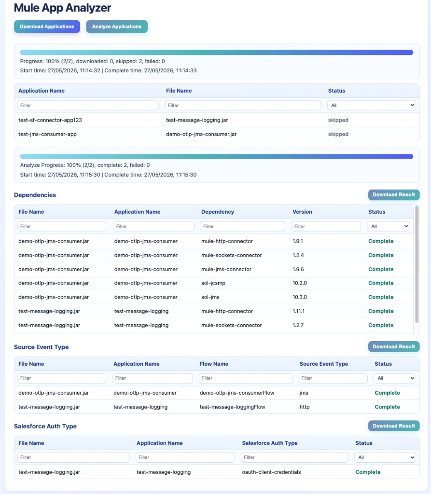

# mule-app-analyzer

## Overview

`mule-app-analyzer` is a Node.js web app for downloading and analyzing MuleSoft application packages.

Current scope:
- Currently supports the CloudHub 1.0 download workflow. Support for CloudHub 2.0 and RTF downloads will be added in the future.
- Analyzes Mule application archives in `mule-apps/`. 
- Supports both `.jar` and `.zip` application files

## Prerequisites

1. Node.js `v26.0.0` or newer
2. A Connected App in Anypoint Platform with:
   - Runtime Manager: Download Applications
   - Runtime Manager: Read Applications
3. Connected App credentials:
   - `client_id`
   - `client_secret`

## Run the Application

Install dependencies:

```bash
npm install
```

Start the app:

```bash
node mule-app-analyzer <client_id> <client_secret>
```

Open in browser:

```text
http://localhost:3000/
```

## Web UI Workflow

After startup, the page shows two buttons:
- `Download Applications`
- `Analyze Applications`

Example UI screenshot:



_Sample output after running download and analyze workflows._

### 1) Download Applications

Runs the CloudHub 1.0 download flow:
1. Get access token
2. List applications
3. Download application package files into `mule-apps/`

Behavior:
- Creates `mule-apps/` if missing
- Skips files already present in `mule-apps/` (by `fileName`)
- Shows progress in table + percentage

This step is optional if you already have application `.jar`/`.zip` files.  
You can place them directly in `mule-apps/` and then run Analyze.

### 2) Analyze Applications

Analyzes all `.jar` and `.zip` files in `mule-apps/` and fills result tables.

#### Table A: Dependencies
Columns:
- `File Name`
- `Application Name`
- `Dependency`
- `Version`
- `Status`

Data source:
- Reads `pom.xml` from each archive
- Uses:
  - `project.name` as `Application Name`
  - each `dependencies.dependency.artifactId` as `Dependency`
  - each `dependencies.dependency.version` as `Version`

#### Table B: Source Event Type
Columns:
- `File Name`
- `Application Name`
- `Flow Name`
- `Source Event Type`
- `Status`

Logic:
- Scans Mule XML files in the application package
- Finds `<flow name="..."> ... </flow>`
- Detects event sources with pattern `<*:listener`  
  Examples: `<http:listener>`, `<jms:listener>`
- Populates:
  - `Flow Name` from `flow name`
  - `Source Event Type` from namespace prefix (`http`, `jms`, etc.)

#### Table C: Salesforce Auth Type
Columns:
- `File Name`
- `Application Name`
- `Salesforce Auth Type`
- `Status`

Logic:
- Includes only applications that contain `<salesforce:sfdc-config ...>`
- Inside each config, finds tags like `<salesforce:*-connection .../>`
- Populates `*` into `Salesforce Auth Type`  
  Examples: `oauth-user-pass`, `oauth-client-credentials`

Applications without Salesforce config are skipped from this table.

## CloudHub 1.0 API Sequence (Reference)

### 1) Get Access Token

Endpoint:

```text
https://anypoint.mulesoft.com/accounts/api/v2/oauth2/token
```

Request:

```json
{
  "client_id": "{{connected_app_client_id}}",
  "client_secret": "{{connected_app_client_secret}}",
  "grant_type": "client_credentials"
}
```

Sample response:

```json
{
  "access_token": "2cd9e3b2-55c6-4c2c-9c89-87cf61d9c4ee",
  "expires_in": 2212,
  "token_type": "bearer"
}
```

### 2) Get Application List

Endpoint:

```text
https://anypoint.mulesoft.com/cloudhub/api/v2/applications
```

Important fields used:
- `domain`
- `fileName`

### 3) Download Application Package

Endpoint template:

```text
https://anypoint.mulesoft.com/cloudhub/api/applications/{{domain}}/download/{{fileName}}
```